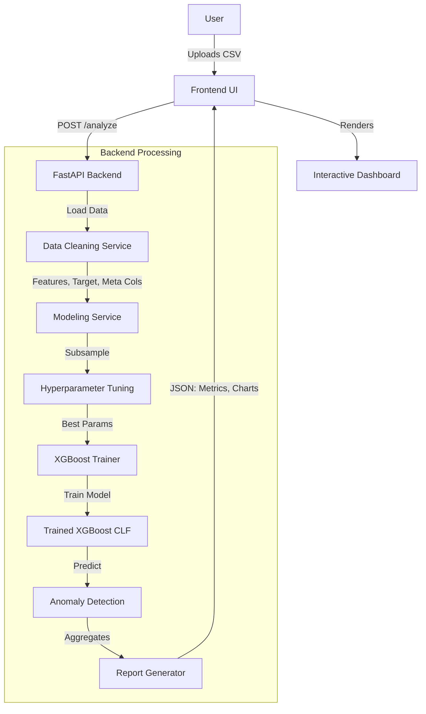

# CryptoGuard Technical Documentation

## 1. System Architecture

The system follows a typical Client-Server architecture designed for real-time analysis of uploaded datasets.

## 2. Core Modules

### 2.1. Feature Engineering & Cleaning (`app/services/cleaning.py`)
This module prepares raw CSV data for machine learning.
*   **Meta Column Extraction**: automatically identifies columns that are "Identifiers" (e.g., `nameOrig`, `account_id`) rather than predictive features. These are **removed** from training to prevent data leakage (100% accuracy due to memorization) but kept for the final report.
*   **Auto-Target Detection**: Heuristically finds the label column using keywords (`isFraud`, `Class`, `Target`) or binary column analysis.
*   **Imputation**: Fills missing values with standard strategies (Mean for numeric, Mode for categorical).

### 2.2. ML Modeling (`app/services/modeling.py`)
This module handles the intelligence of the system.
*   **Algorithm**: **XGBoost** (Extreme Gradient Boosting) is used for its superior performance on structured tabular data.
*   **Handling Imbalance**: Automatically calculates `scale_pos_weight` based on the ratio of Fraud vs Non-Fraud cases to ensure the model doesn't just predict "Legal" for everything.
*   **Smart Tuning**:
    *   If the dataset is large (>20k rows), it performs Hyperparameter Tuning (RandomizedSearchCV) on a **stratified subsample** (20k rows) to find optimal settings quickly.
    *   It then retrains the final model on the **Full Dataset** using those optimal settings.

### 2.3. Entity-Centric Aggregation
Unlike standard models that just output "Row X is Fraud", CryptoGuard connects the dots:
1.  It maps the **Predicted Fraud** row back to the **Entity ID** (`nameOrig`).
2.  It sums up the **Amount** for that Entity.
3.  It generates a distribution showing "Who are the biggest fraudsters?".

## 3. API Reference

### `POST /analyze`
*   **Input**: `multipart/form-data` file (CSV).
*   **Process**: Full pipeline execution (Load -> Clean -> Train -> Predict -> Report).
*   **Output**: JSON object containing:
    *   `metrics`: Accuracy, Precision, Recall, AUC-ROC, Confusion Matrix.
    *   `feature_importance`: Top predictive columns.
    *   `pie_data`: Top fraudulent entities and their associated amounts.
    *   `anomalies`: List of top 20 highest-probability fraud transactions.

## 4. Frontend Implementation

*   **Technology**: Pure HTML/CSS/JS (No heavy frameworks required for this scope).
*   **Visualization**: `Chart.js` is used for rendering the Bar Charts (Features) and Doughnut Charts (Fraud Distribution).
*   **Styling**: Custom CSS variables implement a "Glassmorphism" Dark Mode with neon accents (`#00f2ea`).
