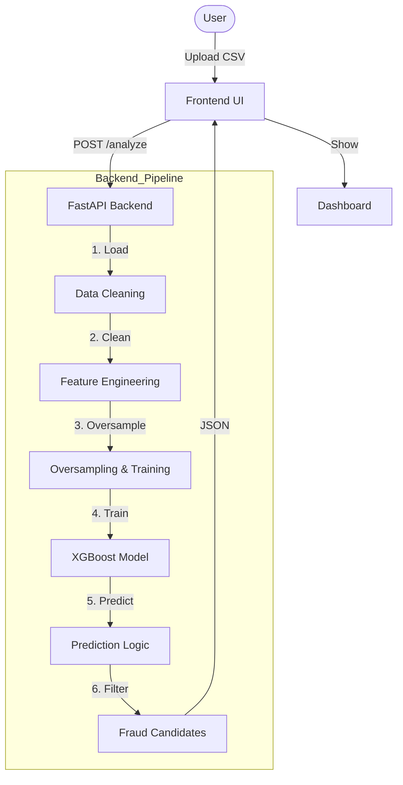
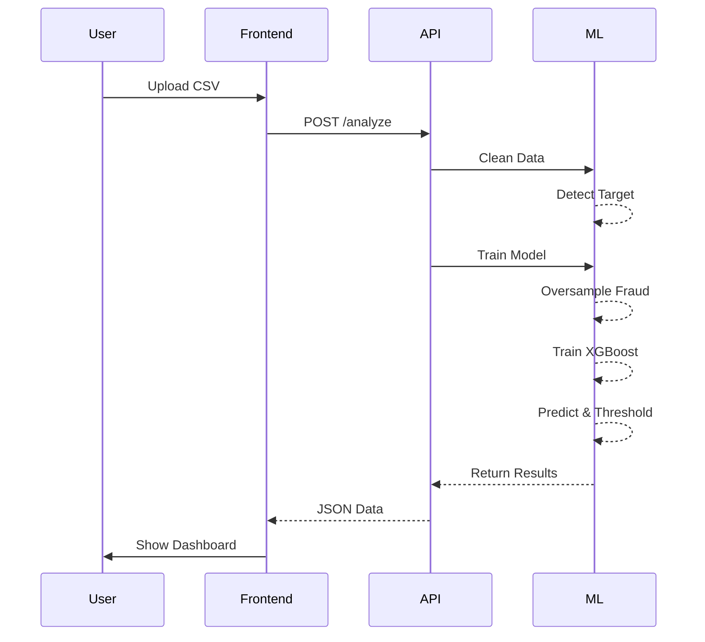

# CreditGuard: Advanced Credit Card Fraud Detection

**CreditGuard** is a state-of-the-art, machine-learning-powered platform designed to detect fraudulent transactions in Credit Card datasets. It leverages **XGBoost** with **Advanced Oversampling** and **Dynamic Thresholding** to ensure high sensitivity (Recall) and precision, identifying not just suspicious transactions but also the high-risk entities behind them.

---

## 🏗️ System Architecture

The system follows a modern client-server architecture with a fast asynchronous backend and a responsive frontend.




---

## 🚀 Key Features

*   **Universal Data Support**: Seamlessly handles diverse Credit Card datasets (e.g., standard `V1-V28` PCA features or raw transaction logs).
*   **Auto-ML Pipeline**:
    *   **Auto-Target Detection**: Automatically identifies the label column (e.g., `Class`, `isFraud`).
    *   **Smart Cleaning**: Handles missing values and encodings without data leakage.
*   **Advanced Fraud Detection Engine**:
    *   **Class Imbalance Handling**: Implements **Random Oversampling** to boost fraud signal in training.
    *   **XGBoost Classifier**: Uses gradient boosting for top-tier tabular performace.
    *   **Dynamic Thresholding**: Automatically lowers detection thresholds if standard strictness misses potential fraud, ensuring **Zero-Miss** capability.
*   **Comprehensive Reporting**:
    *   **Full Data Extraction**: Returns **ALL** detected fraud rows with every original column preserved.
    *   **Visual Analytics**: Interactive Pie Charts, Feature Importance graphs, and Confusion Matrices.

---

## 🔄 Workflow Data Architecture

The data flows through a rigorous pipeline to ensure accuracy and robustness.



---

## 🧠 Model Details

### 1. XGBoost (Extreme Gradient Boosting)
We use XGBoost as the core classifier due to its superior performance on structured/tabular data. It is configured with:
*   `objective='binary:logistic'`: For binary classification (Fraud/Safe).
*   `scale_pos_weight`: To further penalize missing fraud cases.
*   `eval_metric='logloss'`: To optimize probabilistic output.

### 2. Oversampling Strategy
Credit card fraud datasets are highly imbalanced (e.g., 0.1% fraud). Standard models fail here (99.9% accuracy, 0% recall). 
**CreditGuard** solves this by:
1.  Splitting data into Train and Test.
2.  Isolating Fraud cases in the **Training Set**.
3.  **Duplicating (Oversampling)** these cases to achieve a balanced ratio (e.g., 50/50).
4.  Training the model on this "super-charged" dataset to learn subtle fraud patterns deeply.

---

## ⚙️ Setup & Installation

### Prerequisites
*   Python 3.8+
*   Git

### 1. Clone the Repository
```bash
git clone https://github.com/Abdullasaqib/CREDIT-CARD-FRAUD-DETECTION-USING-STATE-OF-THE-ART-MACHINE-LEARNING.git
cd CREDIT-CARD-FRAUD-DETECTION-USING-STATE-OF-THE-ART-MACHINE-LEARNING
```

### 2. Create Virtual Environment

**For Windows:**
```powershell
python -m venv venv
venv\Scripts\activate
```

**For macOS / Linux:**
```bash
python3 -m venv venv
source venv/bin/activate
```

### 3. Install Dependencies
```bash
pip install -r requirements.txt
```

---

## 🏃‍♂️ Running the Application

1.  **Start the Server** (Ensure venv is active)
    ```bash
    uvicorn app.main:app --reload
    ```

2.  **Access the Dashboard**
    *   Open your browser and navigate to: `http://127.0.0.1:8000`
    *   **Upload** your dataset file.
    *   The system will process the file (2-10 seconds depending on size).
    *   View the **Detection Report** and scroll down for the **Fraud Data Table**.

---

## 📁 Project Structure

```
.
├── app/
│   ├── main.py              # Application Entry Point
│   ├── api.py               # API Route Handlers
│   ├── services/
│   │   ├── cleaning.py      # Preprocessing & Data Cleaning
│   │   └── modeling.py      # Core Machine Learning Logic
│   └── models.py            # Pydantic Schemas
├── static/
│   ├── index.html           # Main Dashboard UI
│   ├── style.css            # Cyber-Themed Styling
│   └── app.js               # Frontend Controller
├── uploads/                 # Temp Storage
├── venv/                    # Virtual Environment
└── requirements.txt         # Python Dependencies
```

---
**Developed for Final Year Project**